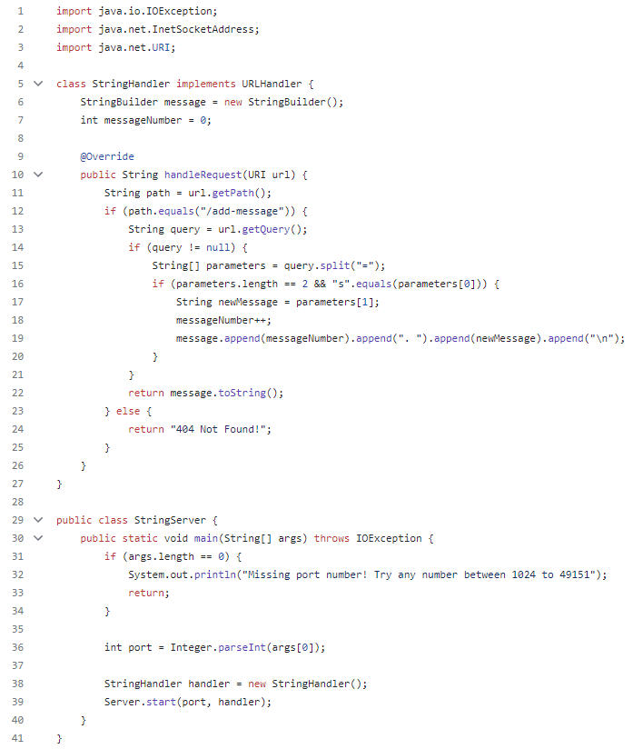
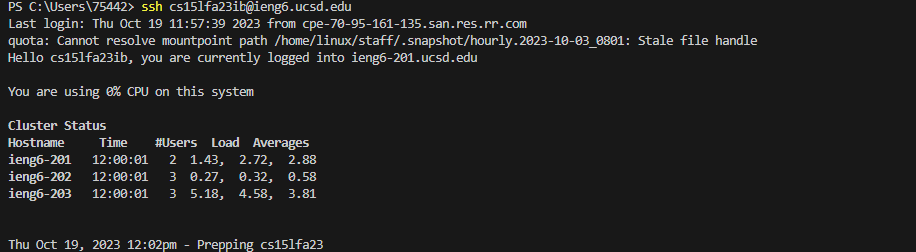

# Part 1
 
 __I get this by changing some code from NumberServer, so the framework is almost the same.__

  
__1. The first test, 'hello' calls the StringHandler method.__  
__2. The relevant argument of Handler is HttpExchange, and then the request URL will grab the string in the query after the path and store it in newMessage.__  
__3. Increase the corresponding Messagenumber. The message field now has ‘1. Hello \n’.__  

  
__1. The Second test, '123' also calls the StringHandler Method.__  
__2. It is also the same as above because the code reads these numbers as strings, not integers. So the code will also check for the change in the URL as an argument, read the path and query, and store it in newMessage.__  
__3. It also changes the Messagenumber increase one. Note I tried on my own but didn't screenshot it once; that makes this time the third time, so Messagenumber is now 3, and the message field now has'1. Hello \n 2. number \n 3. 123\n'__  
# Part 2
__1.__
  
  
__2.__
  
__I note that the remote computer from ieng6 seems to have hidden my .ssh folder. I can't use ls in the main folder to see it, but I can use ls or cd .ssh path to call it out.__  
  
  

__3.__
  

# Part 3  

__I have learned Java and its related code programming elsewhere before. However, I have never used terminal and remote computer access, so I think I have learned some relevant commands in the current course on using these helpful tools to create a Web Server.__

